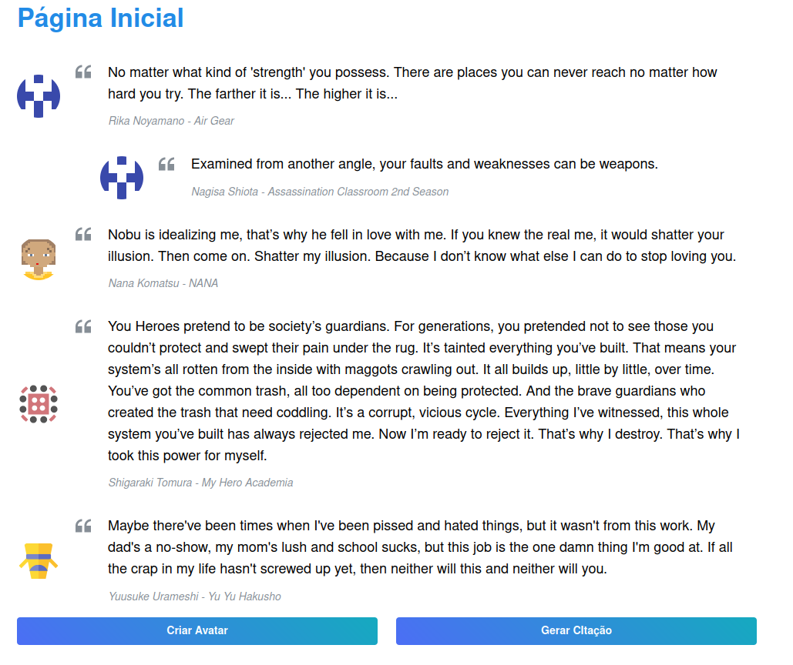
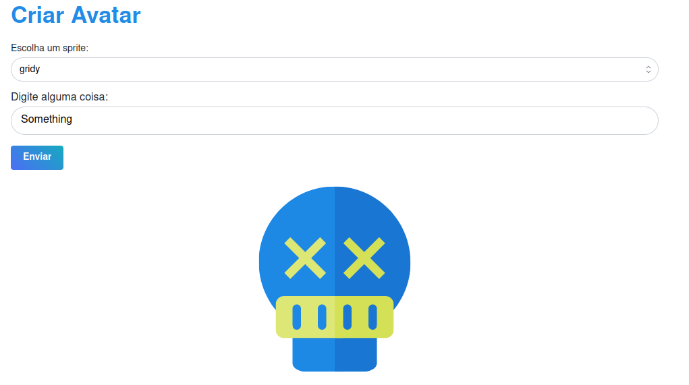
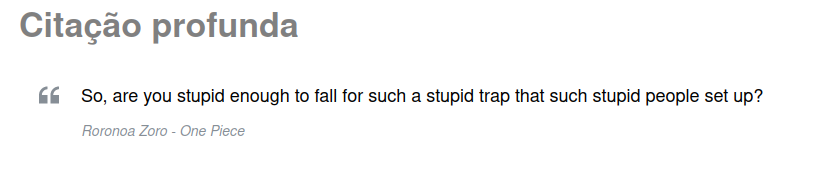
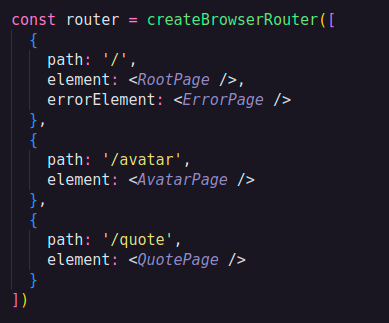
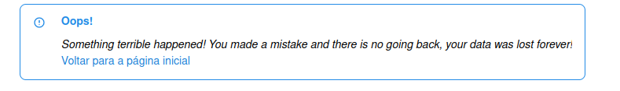

# Introdução à Criação de Aplicação React

Este projeto foi inicializado com [Create React App](https://github.com/facebook/create-react-app).

## Scripts disponíveis

No diretório do projeto, você pode executar:

### `npm start`

Executa o aplicativo no modo de desenvolvimento.\
Abra [http://localhost:3000](http://localhost:3000) para visualizá-lo em seu navegador.

A página será recarregada quando você fizer alterações.\
Você também pode ver erros de lint no console.

# Sobre

A aplicação consiste em um gerador de avatar e citações dado algumas constantes. O projeto deu foco a trabalhar a prática de alguns conceitos que o React.js nos proporciona.

São alguns desses conceitos:

### `Consumo de API`

#### No caso está sendo usado duas API's públicas, as duas vão devolver informações através de requisições HTTP em formato JSON sendo a [Dicebear Avatars](https://avatars.dicebear.com/) para de avatares e [AnimeCHan](https://github.com/RocktimSaikia/anime-chan) para às citações

### Demonstração:

- AVATAR - Por meio de poucos cliques em que é feito a seleção de uma sprite predefinida (constante) disponivél pela API e uma semente geradora (seed) temos um avatar criado !

- CITAÇÃO - Ao ser direcionado à página de citações quase que instantaneamente é recebido às informações necessárias enviadas pela API para compor nosso componente.

### `Roteamento de Páginas`

#### O projeto conta com o mecanismo de roteamento das páginas por meio de rotas disponibilizado pelo React.js, que nesse caso será de apenas 3 rotas sendo elas:

#### Este roteamento consta com um tratamento de erro, para o caso de acesso de rotas que não estão de acordo com as previamente estipuladas.

### `Biblioteca de Componentes`

#### A aplicação tem em suas dependencias a instalação da biblioteca [Mantine](https://mantine.dev/) para auxilio da construção da estrutura do front-end.
